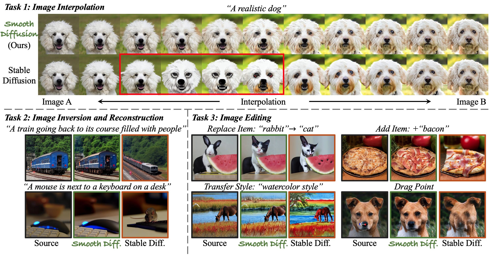
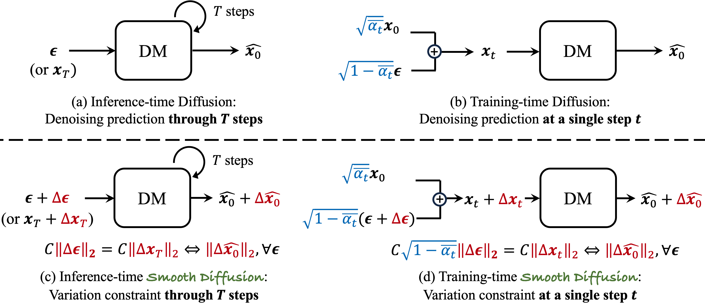
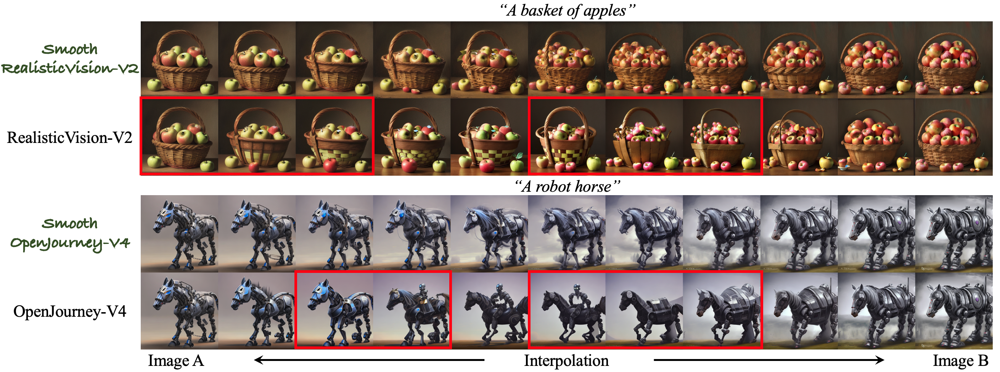
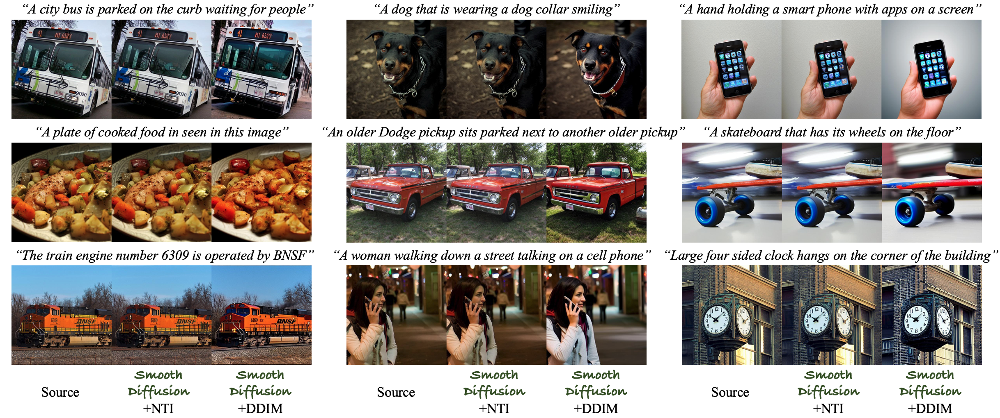
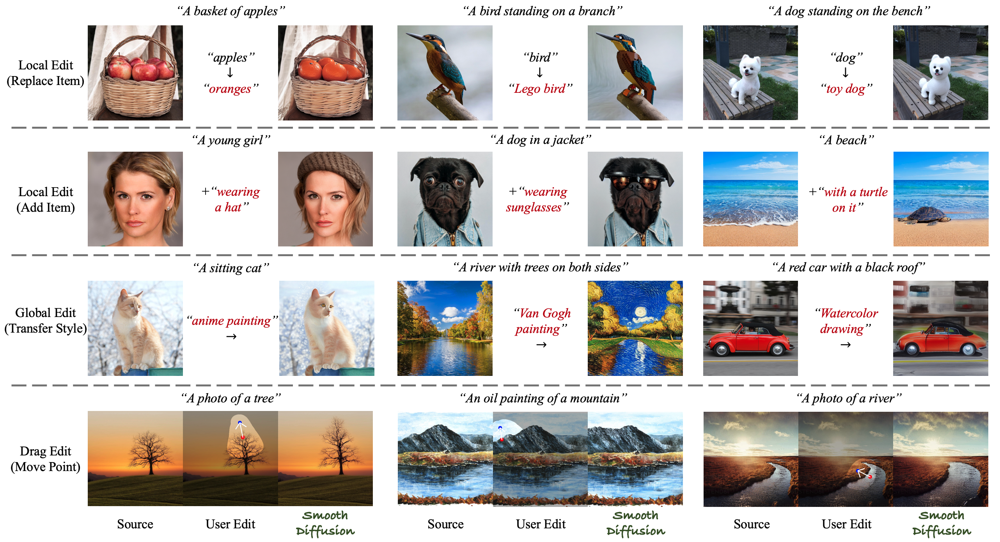

# Smooth Diffusion

This repository is the official Pytorch implementation for [Smooth Diffusion](https://arxiv.org/abs/2312.04410).

[](https://huggingface.co/spaces/shi-labs/Smooth-Diffusion) [](https://shi-labs.github.io/Smooth-Diffusion/) [](https://arxiv.org/abs/2312.04410) 

> **Smooth Diffusion: Crafting Smooth Latent Spaces in Diffusion Models**  
> [Jiayi Guo](https://www.jiayiguo.net)\*,
> [Xingqian Xu](https://www.linkedin.com/in/xingqian-xu-97b46526/)\*,
> [Yifan Pu](https://scholar.google.com/citations?user=oM9rnYQAAAAJ&hl=en),
> [Zanlin Ni](https://scholar.google.com/citations?user=Yibz_asAAAAJ&hl=en),
> [Chaofei Wang](https://scholar.google.com/citations?user=-hwGMHcAAAAJ&hl=en),
> [Manushree Vasu](https://in.linkedin.com/in/v-manushree),
> [Shiji Song](https://scholar.google.com/citations?user=rw6vWdcAAAAJ&hl=en&oi=ao),
> [Gao Huang](https://www.gaohuang.net),
> [Humphrey Shi](https://www.humphreyshi.com)


https://github.com/JiayiGuo821/Smooth-Diffusion-Dev/assets/53193040/f965242f-968e-4e62-845c-dd3374a70fcf


<p align="center">
<strong>Smooth Diffusion</strong> is a new category of diffusion models that is simultaneously high-performing and smooth.
</p>

<p align="center">

Our method formally introduces latent space smoothness to diffusion models like Stable Diffusion. This smoothness dramatically aids in: 1) improving the continuity of transitions in image interpolation, 2) reducing approximation errors in image inversion, and 3) better preserving unedited contents in image editing.
</p>

## News
- [2024.03.25] Our demo is available on 🤗 [Huggingface Space](https://huggingface.co/spaces/shi-labs/Smooth-Diffusion)!
- [2024.03.20] Code, model, and demo released!
- [2024.02.27] Smooth Diffusion is accepted by CVPR 2024!
- [2023.12.08] Paper released!

## ToDo
- ☑️ Release code and model weights
- ☑️ Gradio Demo


## Overview
<p align="center">

<strong>Smooth Diffusion</strong> (c) enforces the ratio between the variation of the input latent and the variation of the output prediction is a constant. We propose <strong>Training-time Smooth Diffusion</strong> (d) to optimize a "single-step snapshot" of the variation constraint in (c). DM: Diffusion model. Please refer to our paper for additional details.
</p>

## Code
### Setup
```
conda create --name smooth-diffusion python=3.9
conda activate smooth-diffusion
pip install torch==2.0.0 torchvision==0.15.1 torchaudio==2.0.1
pip install -r requirements.txt
```

### Inference (Gradio Demo)
We provide a WebUI empowered by [Gradio](https://github.com/gradio-app/gradio). Start the WebUI with the following command:
```
python app.py
```

### Training
We provide scripts for data downloading and training. Unfortunately, the LAION dataset is currently unavailable due to safety review. [[Offcial note by LAIOM.ai](https://laion.ai/notes/laion-maintanence/)]
```
# Download LAION aesthetics 6.5+
python download_regularization_images.py
# Train smooth LoRA
bash train.sh
```

## Visualizations
### Image Interpolation  
  
> Using the Smooth LoRA trained atop Stable Diffusion V1.5.

<p align="center">

</p>

> Integrating the above Smooth LoRA into other community models.

<p align="center">

</p>

### Image Inversion

<p align="center">

</p>

### Image Editing

<p align="center">

</p>

## Citation

If you find our work helpful, please **star 🌟** this repo and **cite 📑** our paper. Thanks for your support!

```
@InProceedings{guo2024smooth,
  title={Smooth Diffusion: Crafting Smooth Latent Spaces in Diffusion Models},
  author={Jiayi Guo and Xingqian Xu and Yifan Pu and Zanlin Ni and Chaofei Wang and Manushree Vasu and Shiji Song and Gao Huang and Humphrey Shi},
  booktitle={Proceedings of the IEEE/CVF Conference on Computer Vision and Pattern Recognition (CVPR)},
  year={2024}
}
```

## Acknowledgements
We thank [Diffusers](https://huggingface.co/docs/diffusers/en/index) (LoRA finetuning) and [AlignSD](https://huggingface.co/docs/diffusers/en/index) (data downloading).

## Contact
guo-jy20 at mails dot tsinghua dot edu dot cn


